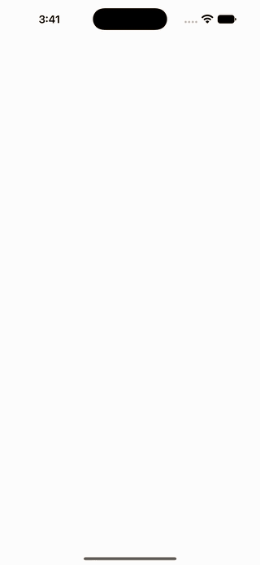

<p align="center">
  
</p>

<h1 align="center">Minted</h1>

<p align="center">
  Turn any SVG into a physically-lit 3D gold medallion for SwiftUI.<br />
  Cloisonne enamel, engraved lettering, orange-peel backs, and momentum spins. No 3D assets, ever.
</p>

<p align="center">
  
  
  
</p>

---

## Why

Achievement badges, collectibles, loyalty stamps, awards: they all want to feel like *things*. Minted takes flat vector art you already have and strikes it into a solid gold coin with glossy enamel inlays, real studio reflections that sweep across the metal as it turns, and a die-struck orange-peel back. Everything is generated geometry from your 2D paths, so your app ships zero model files.

## Installation

In Xcode: **File > Add Package Dependencies** and paste

```
https://github.com/haplollc/Minted
```

Or in `Package.swift`:

```swift
dependencies: [
    .package(url: "https://github.com/haplollc/Minted", from: "1.0.0")
]
```

## Mint your first coin

Three lines from SVG path data to a spinning medallion:

```swift
import Minted

let heart = CoinDesign(svgPathData: "M12 21s-6.7-4.35-9.33-8.11 ...")!

SpinningCoinView(design: heart)   // idles in a slow spin; drag to flick it
    .frame(width: 300, height: 300)
```

Have a whole SVG file? Hand it over and every `<path>` inside is merged and placed via the viewBox:

```swift
let logo = CoinDesign(svgFileData: try Data(contentsOf: fileURL))!
```

Or skip SVG entirely and mint any `CGPath` or SwiftUI `Path`:

```swift
let starburst = CoinDesign(art: Path(ellipseIn: CGRect(x: 0, y: 0, width: 1, height: 1)))
```

## Make it yours

Every knob has a sensible default, so you add only what you want:

```swift
let award = CoinDesign(
    svgPathData: trophySVG,
    silhouette: .seal,                 // .seal, .octagon, .circle, .diamond, .custom(CGPath)
    palette: CoinPalette(
        field: .systemIndigo,          // the petals behind the art
        art: .white                    // the art's enamel
    ),
    engraving: .petals,                // .petals, .rays, .lattice, .plain
    topText: "EMPLOYEE",               // engraved along the crown
    bottomText: "OF THE MONTH"         // engraved along the base
)!
```

Two-tone art, like a snow-capped mountain:

```swift
CoinPalette(art: .white, artLower: .systemBlue, artSplit: 0.34)
```

## Grids and stills

Live SceneKit views are for hero moments. For a grid of coins, use the
snapshot pipeline: it renders each design once, off the main thread, and
caches to disk.

```swift
CoinThumbnailView(design: award, size: 120)
```

Need the image itself (for sharing, notifications, widgets)?

```swift
let image = await CoinSnapshotter.shared.snapshot(design: award, pixelSize: 1024)
```

And for locked or unearned states, the same design as quiet line work:

```swift
CoinLineArt(design: award, size: 120)
```

## Show the back

The reverse has a die-struck orange-peel texture. Start a coin turned around:

```swift
SpinningCoinView(design: award, initialRotation: .pi)
```

## How it works

- Your path is extruded with SceneKit's `SCNShape`: a solid gold body, stacked rim bands for the rounded lip, enamel cells sitting a hair proud of the face, and a raised gold wire hugging the art's every edge, the way a real cloisonne pin is built.
- Materials are physically based (gold at metalness 1.0) and lit by a generated studio environment: softboxes, a window streak, a warm floor bounce. That is what sweeps across the metal when the coin turns.
- The SVG parser covers the full `d` grammar: absolute and relative commands, chained curves with reflection, elliptical arcs (converted to cubics per the SVG spec), implicit repeats, and packed numbers like `1.5e-2-3`.
- Lettering is real type: CoreText glyph outlines laid along the arcs, letters upright, in a deeper engraved gold so they stay legible under hot reflections.

## Requirements

- iOS 17.0+
- Swift 5.9+ / Xcode 15+

## License

Minted is available under the [MIT license](LICENSE).

Made by [Haplo LLC](https://haploapp.com). Extracted from [Bilbo](https://haploapp.com/bilbo), our travel planning app, where landmarks you visit are struck into a passport of medallions.
